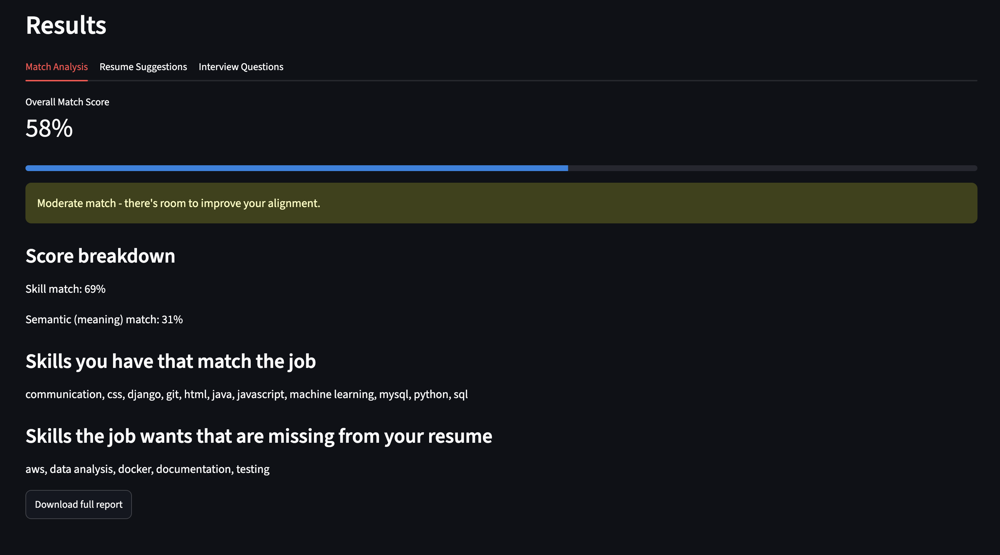
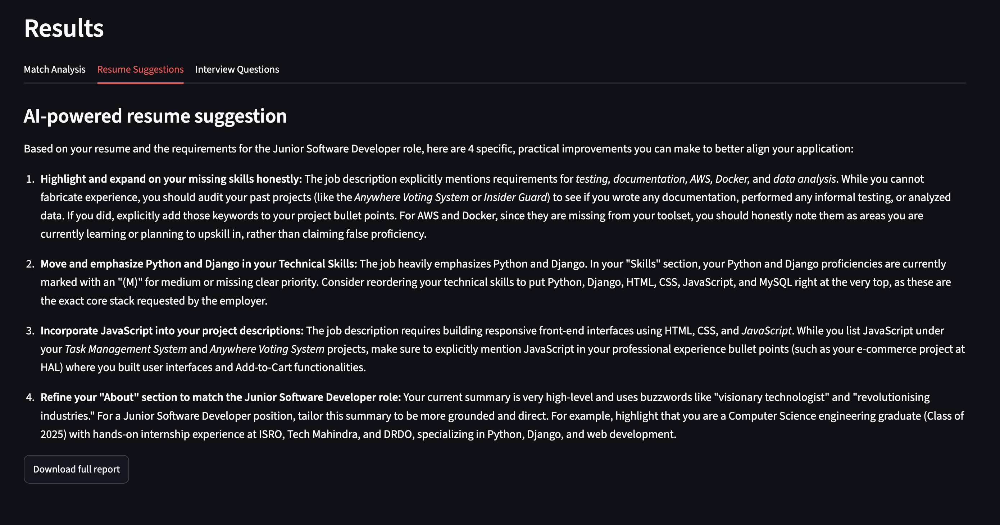
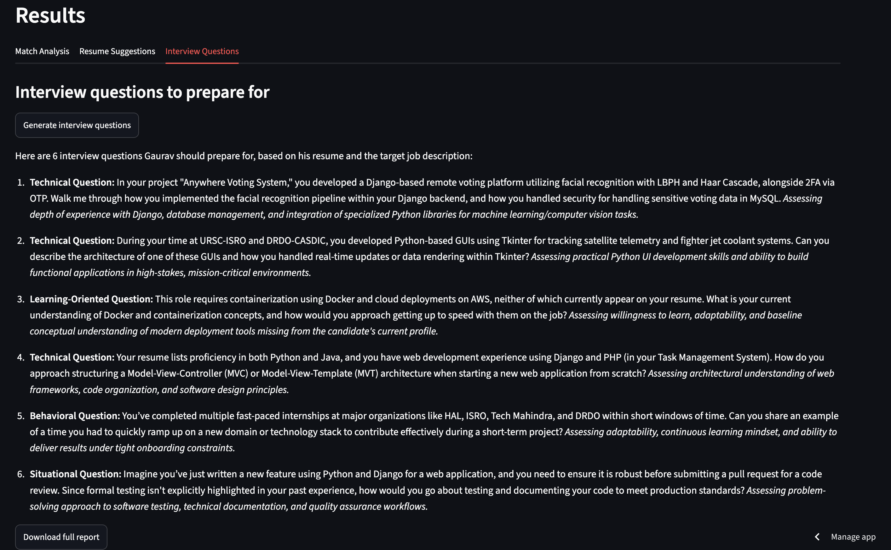

# AI Resume & Interview Assistant

An AI-powered web app that analyses how well a resume matches a specific job description, identifies missing skills, suggests improvements, and generates role-specific interview questions.

**🔗 Live app: https://gaurav-resume-assistant.streamlit.app**

---

## What it does

Upload your resume (PDF or DOCX) and paste a job description. The app then:

- Calculates a **transparent match score** you can actually understand — built from a weighted combination of exact skill matching and semantic (meaning-based) similarity, not an AI-generated guess
- Lists the skills you have that the job wants, and the ones you're missing
- Generates **AI-powered resume suggestions** grounded in your actual experience
- Generates **role-specific interview questions** with notes on what each one assesses
- Lets you **download the full analysis** as a report

## Screenshots

## Screenshots

**Match analysis — transparent score with breakdown and skill gaps**



**AI-generated resume suggestions, grounded in the actual resume**



**Role-specific interview questions with assessment notes**

 

### Planned improvements

- STAR-style answer guidance for interview questions
- Learning resource recommendations for missing skills
- Saved analysis history (with user accounts)
- Expanded skills dictionary

## Tech stack

- **Python** — core language
- **Streamlit** — web interface (pure-Python UI), deployed on Streamlit Community Cloud
- **PyMuPDF** — text extraction from PDF resumes
- **python-docx** — text extraction from DOCX resumes
- **sentence-transformers** — semantic similarity via embeddings (`all-MiniLM-L6-v2`)
- **Google Gemini API** — LLM-generated suggestions and interview questions
- **Git & GitHub** — version control, with automatic deployment on push

## How it works

The app deliberately uses **the simplest tool that solves each problem**, rather than reaching for AI everywhere.

**1. Text extraction** — PDF and DOCX are different formats internally, so each uses a dedicated library (PyMuPDF, python-docx). Both produce the same clean plain text, so the rest of the pipeline never has to care about file formats.

**2. Skill extraction** — deterministic keyword matching against a curated skills list, not an LLM. This is a deliberate choice: skill detection feeds a score the user will trust and act on, and an LLM could hallucinate skills that aren't there. Keyword matching is transparent and verifiable — it can only report a skill that's genuinely present in the text.

**3. Match scoring** — a weighted formula, not an AI-generated number: 

```
score = (0.7 × skill match %) + (0.3 × semantic similarity %)
```

Exact skill matching is transparent and actionable ("you're missing Docker") but blind to synonyms. Semantic similarity (via sentence embeddings) catches meaning — recognising that "ML" and "machine learning" are the same — but is harder to explain on its own. Combining them with explicit weights gives a score that is both meaning-aware and fully explainable: the app shows the user each component.

**4. AI suggestions and interview questions** — this is where an LLM genuinely earns its place. Generating fluent, contextual advice is exactly what language models are good at, and the stakes are lower: the user reviews suggestions rather than trusting them blindly. Prompts include explicit anti-hallucination constraints instructing the model to use only information present in the resume, and to recommend *gaining* a missing skill rather than fabricating experience.

## Running locally

```bash
# Clone the repository
git clone https://github.com/GauravManju/ai-resume-assistant.git
cd ai-resume-assistant

# Create and activate a virtual environment
python3 -m venv venv
source venv/bin/activate

# Install dependencies
pip install -r requirements.txt
```

Create a `.env` file in the project root with your Gemini API key:

```
GEMINI_API_KEY=your_key_here
```

You can get a free key from [Google AI Studio](https://aistudio.google.com/apikey).

Then run the app:

```bash
streamlit run app.py
```

## Known limitations

- **Skill detection is dictionary-based.** The app only recognises skills in its curated list, so it may miss unusual or very new technologies. Expanding this list is a planned improvement.
- **Text extraction requires real text.** Scanned or image-based PDFs won't extract, as no OCR step is included.
- **Free-tier rate limits.** AI features use Google Gemini's free tier and are subject to daily request limits, so generation may occasionally be unavailable.
- **Streamlit layout constraints.** Streamlit was chosen for rapid development in pure Python; the trade-off is limited fine-grained control over responsive layout compared to a custom front end.

