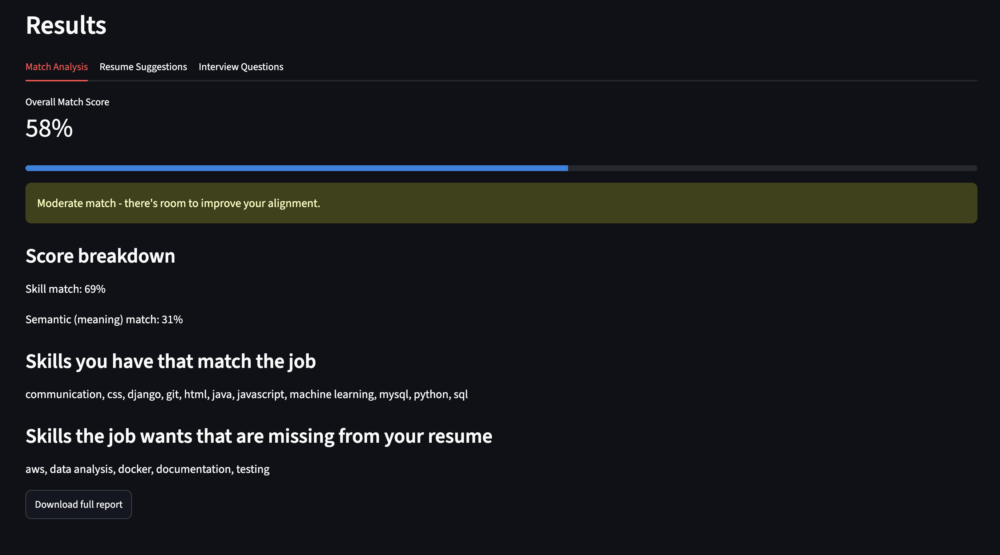
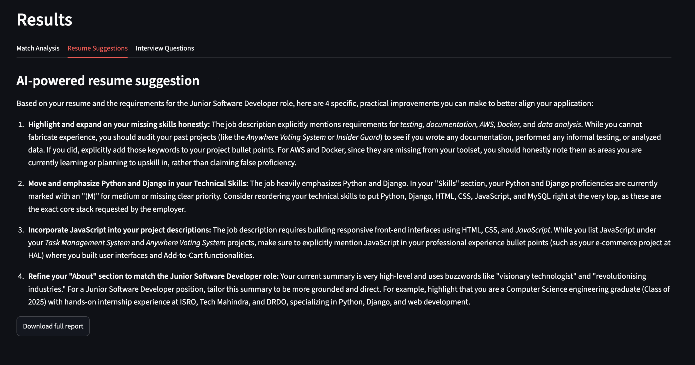
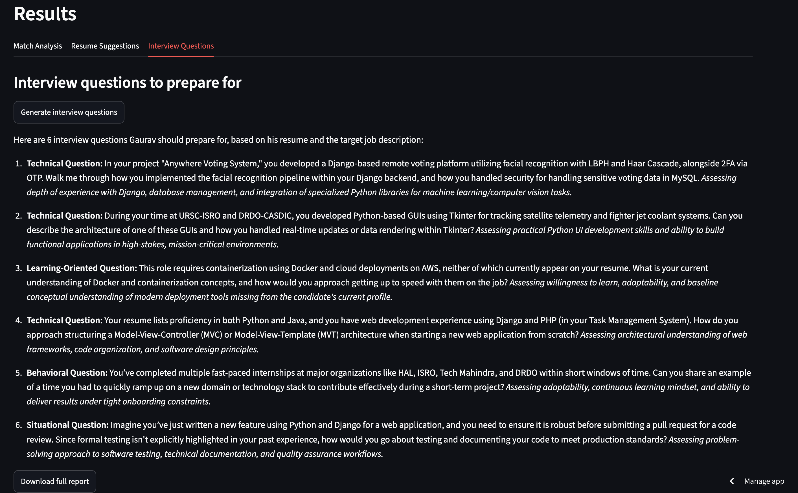
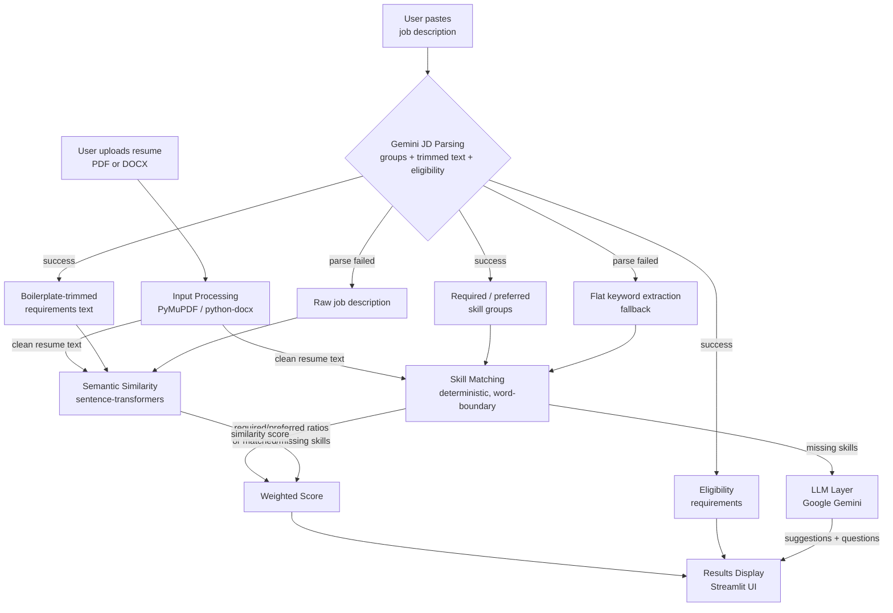

# AI Resume & Interview Assistant

An AI-powered web app that analyses how well a resume matches a specific job description, identifies missing skills, suggests improvements, and generates role-specific interview questions.

**🔗 Live app: https://gaurav-resume-assistant.streamlit.app**

---

## What it does

Upload your resume (PDF or DOCX) and paste a job description. The app then:

- Calculates a **transparent match score** you can actually understand — built from a weighted combination of required-skill matching, preferred-skill matching, and semantic (meaning-based) similarity, not an AI-generated guess
- Understands **OR-relationships** in job descriptions ("React or Angular") instead of penalizing you for missing every alternative
- Separates **required vs. preferred** skills, and flags **eligibility requirements** (visa sponsorship, residency, clearances) that a skill score alone can't capture
- Lists the skills you have that the job wants, and the ones you're missing
- Generates **AI-powered resume suggestions** grounded in your actual experience
- Generates **role-specific interview questions** with notes on what each one assesses
- Lets you **download the full analysis** as a report

## Screenshots

**Match analysis — transparent score with breakdown and skill gaps**



**AI-generated resume suggestions, grounded in the actual resume**



**Role-specific interview questions with assessment notes**

 

### Planned improvements

- STAR-style answer guidance for interview questions
- Learning resource recommendations for missing skills
- Saved analysis history (with user accounts)

## Tech stack

- **Python** — core language
- **Streamlit** — web interface (pure-Python UI), deployed on Streamlit Community Cloud
- **PyMuPDF** — text extraction from PDF resumes
- **python-docx** — text extraction from DOCX resumes
- **sentence-transformers** — semantic similarity via embeddings (`all-MiniLM-L6-v2`)
- **Google Gemini API** — job description parsing (structured output), resume suggestions, and interview questions
- **Pydantic** — schema validation for Gemini's structured job-description output
- **Git & GitHub** — version control, with automatic deployment on push

## How it works

The app deliberately uses **the simplest tool that solves each problem**, rather than reaching for AI everywhere.

**1. Text extraction** — PDF and DOCX are different formats internally, so each uses a dedicated library (PyMuPDF, python-docx). Both produce the same clean plain text, so the rest of the pipeline never has to care about file formats.

**2. Job description parsing** — real job postings mix genuine requirements with company boilerplate (benefits, EEO statements, "about us" copy), express alternatives ("React or Angular"), and separate required from preferred skills — none of which a flat keyword list can represent. Gemini parses the pasted job description into structured JSON: required/preferred skill groups (each group is a set of interchangeable alternatives), the posting trimmed down to just its actual requirements, and any explicit eligibility requirements (visa sponsorship, residency, clearances). If this call fails or returns malformed data, the app falls back to the original flat keyword-matching approach rather than breaking.

**3. Skill matching** — deterministic word-boundary matching against the parsed groups (or, in fallback mode, against a curated skills list), not an LLM. This is a deliberate choice: skill detection feeds a score the user will trust and act on, and an LLM could hallucinate skills that aren't there. Whether a specific skill is present in the resume text is always decided by regex matching, never by the LLM — Gemini's role is limited to understanding the *structure* of the job description, not judging whether the candidate has a skill.

**4. Match scoring** — a weighted formula, not an AI-generated number:

```
score = (0.60 × required-skill match %) + (0.15 × preferred-skill match %) + (0.25 × semantic similarity %)
```

(Fallback mode, when Gemini's parse is unavailable, uses a simpler `0.7 × skill match % + 0.3 × semantic similarity %` against the raw job description.)

Exact skill matching is transparent and actionable ("you're missing Docker") but blind to synonyms. Semantic similarity (via sentence embeddings, computed against the boilerplate-trimmed requirements text) catches meaning — recognising that "ML" and "machine learning" are the same — but is harder to explain on its own. Combining them with explicit weights gives a score that is both meaning-aware and fully explainable: the app shows the user each component.

**5. AI suggestions and interview questions** — this is where an LLM genuinely earns its place. Generating fluent, contextual advice is exactly what language models are good at, and the stakes are lower: the user reviews suggestions rather than trusting them blindly. Prompts include explicit anti-hallucination constraints instructing the model to use only information present in the resume, and to recommend *gaining* a missing skill rather than fabricating experience.

## Architecture


```mermaid
flowchart TD
    A[User uploads resume<br/>PDF or DOCX] --> B[Input Processing<br/>PyMuPDF / python-docx]
    A2[User pastes<br/>job description] --> P{Gemini JD Parsing<br/>groups + trimmed text + eligibility}
    P -->|success| C1[Required / preferred<br/>skill groups]
    P -->|success| S1[Boilerplate-trimmed<br/>requirements text]
    P -->|success| ELG[Eligibility<br/>requirements]
    P -->|parse failed| C2[Flat keyword extraction<br/>fallback]
    P -->|parse failed| S2[Raw job description]
    B -->|clean resume text| M[Skill Matching<br/>deterministic, word-boundary]
    C1 --> M
    C2 --> M
    B -->|clean resume text| E[Semantic Similarity<br/>sentence-transformers]
    S1 --> E
    S2 --> E
    M -->|required/preferred ratios<br/>or matched/missing skills| D[Weighted Score]
    E -->|similarity score| D
    D --> F[Results Display<br/>Streamlit UI]
    ELG --> F
    M -->|missing skills| G[LLM Layer<br/>Google Gemini]
    G -->|suggestions + questions| F
```

## Running locally

```bash
# Clone the repository
git clone https://github.com/GauravManju/ai-resume-assistant.git
cd ai-resume-assistant

# Create and activate a virtual environment
python3 -m venv venv
source venv/bin/activate

# Install dependencies
pip install -r requirements.txt
```

Create a `.env` file in the project root with your Gemini API key:

```
GEMINI_API_KEY=your_key_here
```

You can get a free key from [Google AI Studio](https://aistudio.google.com/apikey).

Then run the app:

```bash
streamlit run app.py
```

## Known limitations

- **Job description parsing depends on Gemini.** If the parsing call fails or the free tier is rate-limited, the app falls back to flat keyword matching against a curated skills list — functional, but it loses OR-group handling, required/preferred weighting, boilerplate trimming, and eligibility flags for that analysis.
- **Fallback skill detection is dictionary-based.** In fallback mode, the app only recognises skills in its curated list (`src/data/known_skills.json`, generated via `scripts/generate_skills.py`), so it may miss unusual or very new technologies.
- **Text extraction requires real text.** Scanned or image-based PDFs won't extract, as no OCR step is included.
- **Free-tier rate limits.** AI features use Google Gemini's free tier and are subject to daily request limits, so generation may occasionally be unavailable.
- **Streamlit layout constraints.** Streamlit was chosen for rapid development in pure Python; the trade-off is limited fine-grained control over responsive layout compared to a custom front end.

